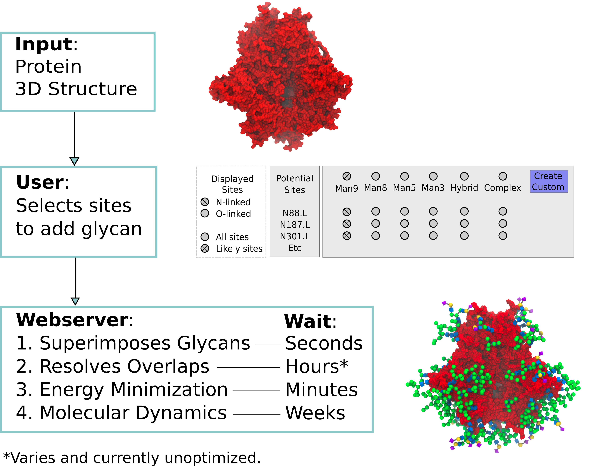

# GlycoProteinBuilder
Uses GEMS/GMML to add and adapt 3D structures of N-glycans and O-glycans onto glycoproteins. It can do this for Asn, Ser, Thr and Tyr.

##Schematic

## Notes
2017-10-27 
Project is under development, contact olivercgrant@gmail.com with queries. 
This code will replace the glycoprotein builder currently available on glycam.org/gp.
Has been tested on linux, but should install on both Mac and Windows with appropriate C++ complilers.

## Prerequisites

You'll need GEMS and GMML. See here for installation instructions: http://glycam.org/docs/gems/download-and-install/.

### Installation of GlycoProteinBuilder
export GEMSHOME=<Your Path To Gems > # eg: export GEMSHOME=/home/oliver/Programs/gems

qmake

make

### Setup
Edit or create an input.txt file and place in a folder called inputs. See inputs/input.txt for an example.

If running outside of the program directory, create a directory called outputs/

You must provide:

    a protein 3D structure

    glycan 3D structure(s)

    input.txt, which contains:

        parameter files (optional, defaults available)

        protein file name

        name of the folder containing the glycans e.g. glycans

        the protein residue numbers you want to attach to (no automatic detection of sequons)

        the name of the glycan you want to attach. Be careful that the name matches the start of the name of the glycan file.

        e.g. m9 will match to m9* in the glycan folder, while m9-gtgt will cause just that rotamer to be added.

        Note that for each protein residue number provided a glycan must be detailed. Allowing you to add different glycans to different sites

